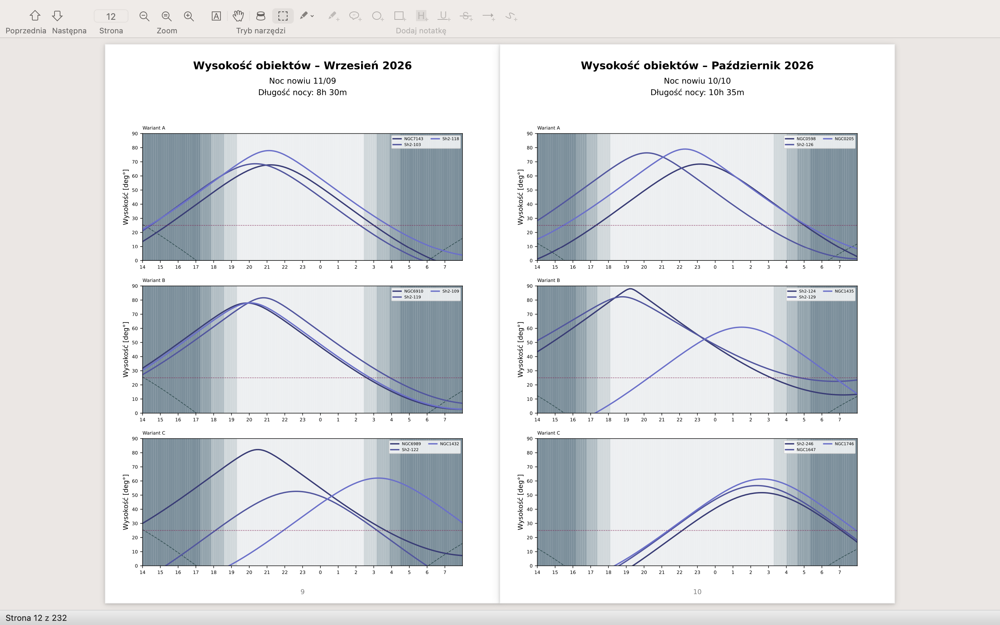
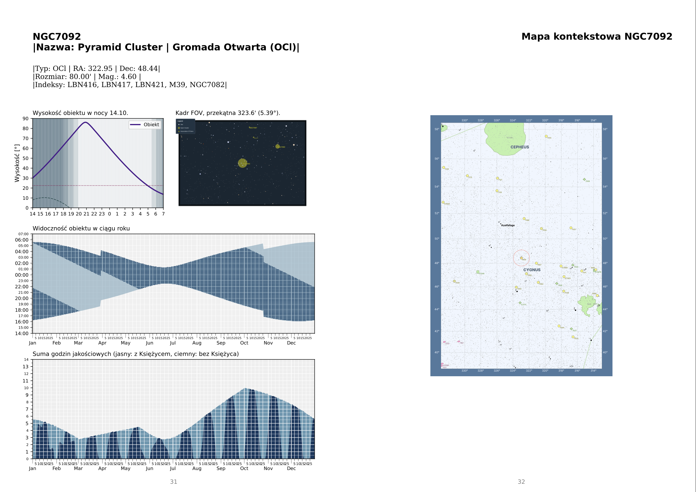

# Astrophotography Planner & Atlas Generator

Zestaw skryptów w języku Python służący do generowania spersonalizowanego rocznego planera astronomicznego oraz atlasu obiektów głębokiego nieba (DSO). Dla niezaawansowanych amatorów nieba. Atomatycznie wybiera z bazy 90k+ obiektów te, którymi warto się zająć w bieżącym roku. Obiekty są "rozkładane" na przestrzeni roku tak, żeby stworzyć najbardziej zachłanny plan astrofotograficzny.

**Powodzenia!**

---

## Szczegóły działania skryptów

System pobiera dane z katalogów astronomicznych, **filtruje** je pod kątem lokalizacji obserwatora i posiadanego sprzętu (teleskop/kamera), oblicza precyzyjną widoczność na dany rok, a następnie generuje profesjonalny plik PDF zawierający: 

1. Przegląd roczny (kiedy obserwować dany obiekt).



2. Szczegółowe strony dla każdego obiektu (wykresy wysokości, kadry FOV, mapy kontekstowe). 



---

## 🚀 Możliwości

- **Agregacja** danych: łączy katalogi NGC/IC, Sharpless (Sh2), RCW, Barnard, LBN, LDN, Cederblad i PGC. 
- **Inteligentne** filtrowanie: wybiera obiekty na podstawie szerokości geograficznej, minimalnej wysokości nad horyzontem, jasności (Mag), rozmiaru oraz skali Bortle. 
- Symulacja FOV: generuje symulacje kadru (Field of View) dla kamery i teleskopu przy użyciu biblioteki `starplot`. 
- Obliczenia astronomiczne: wylicza okna obserwacyjne (godziny bez Księżyca, wysokość górowania). 
- Format PDF: generuje gotowy do druku atlas w formacie A4. 

---

## 🛠️ Wymagania

Projekt wymaga Pythona 3.10+ oraz następujących bibliotek: 

```bash
pip install pandas numpy astropy astroplan matplotlib reportlab pypdf tqdm astroquery starplot networkx
```

**Uwaga:** Biblioteka `starplot` może wymagać dodatkowej konfiguracji (pobrania danych gwiazd). 

---

## 📂 Struktura plików i dane wejściowe

Aby rozpocząć, upewnij się, że posiadasz plik źródłowy dla katalogu NGC (używany w kroku 0): 

- `OpenNGC/NGC.csv` – plik CSV z danymi OpenNGC (wymagany przez skrypt `0_opracuj_katalog_ngc.py`). 

---

## ⚙️ Instrukcja użycia (krok po kroku)

Skrypty są ponumerowane, aby ułatwić zachowanie odpowiedniej kolejności wykonywania operacji. 

### Krok 0: Przygotowanie bazy NGC

Uruchom: 

```bash
python 0_opracuj_katalog_ngc.py
```

- Parsuje surowy plik CSV z OpenNGC. 
- Tworzy plik `updated_ngc.csv`. 

### Krok 1: Pobieranie i unifikacja katalogów

Uruchom: 

```bash
python 1_generuj_katalog_astro.py
```

- Pobiera dane z serwisu VizieR (Sharpless, Barnard, LDN, itp.). 
- Łączy je z bazą NGC. 
- Wykonuje „Smart Merge” (łączenie duplikatów i obiektów blisko siebie). 
- Tworzy plik `katalog_astro_full.csv`. 
- Opcjonalnie: uruchom `analiza_katalog.py`, aby sprawdzić statystyki bazy. 

### Krok 2: Konfiguracja i selekcja obiektów

Uruchom: 

```bash
python 2_ograniczenie_katalogu.py
```

- Interaktywny skrypt: pyta o lokalizację, parametry teleskopu/kamery, filtry (Ha/OIII) oraz minimalną wysokość obiektu. 
- Filtruje bazę pod kątem używanego sprzętu. 
- Tworzy plik konfiguracyjny `vis_data.json` z kandydatami do atlasu. 

### Krok 3: Silnik obliczeniowy (Engine)

Uruchom: 

```bash
python 3_wyliczenia.py
```

- Wykonuje ciężkie obliczenia astronomiczne (równolegle na wielu rdzeniach CPU). 
- Wylicza dokładną widoczność minuta po minucie dla całego roku. 
- Zapisuje wyniki do `observing_data.pkl`. 

### Krok 4: Plan roczny i wybór wariantów

Uruchom: 

```bash
python 4_plan_roczny.py
```

- Analizuje dane z kroku 3. 
- Przydziela obiekty do miesięcy (Warianty A, B, C), aby zbalansować sesje obserwacyjne. 
- Generuje **Część** 1 PDF: `Astrophotography_Planner_2026_1.pdf` (wykresy roczne). 
- Aktualizuje `vis_data.json` o flagę `selected`. 

### Krok 5: Generowanie map nieba

Uruchom: 

```bash
python 5_fov_and_maps.py
```

- Korzysta z biblioteki `starplot`. 
- Generuje pliki PNG w katalogu `starplots/`: 
  - Kadry optyczne (symulacja kamery). 
  - Mapy kontekstowe (szersze pole widzenia). 

### Krok 6: Generowanie stron obiektów

Uruchom: 

```bash
python 6_drukuj_strony_obiektow.py
```

- Składa szczegółowe strony dla każdego wybranego obiektu. 
- Zawiera wykresy wysokości w noc nowiu, wykres roczny, statystyki godzinowe oraz wygenerowane mapy. 
- Tworzy **Część** 2 PDF: `Astrophotography_Planner_2026_2.pdf`. 

### Krok 7: Finalizacja

Uruchom: 

```bash
python 7_polacz_pliki_pdf.py
```

- Generuje stronę tytułową. 
- Łączy część 1 i część 2 w jeden plik. 
- Wynik końcowy: `Astrophotography_Planner_2026.pdf`. 

---

## 📝 Uwagi dodatkowe

- Czcionki: skrypt `7_polacz_pliki_pdf.py` jest skonfigurowany pod system macOS (`/System/Library/Fonts/Helvetica.ttc`); na Windows lub Linux należy edytować ścieżkę do czcionek. 
- Wydajność: krok 3 i 5 wykorzystują wielowątkowość (`multiprocessing`); generowanie map może zająć kilka minut w zależności od liczby obiektów. 
- Lokalizacja: domyślnie ustawiony jest rok 2026 i lokalizacja w Polsce; można to zmienić w trakcie działania skryptu nr 2 lub edytując stałe w plikach. 

---

## 📄 Licencja

Projekt do użytku własnego. Korzysta z danych OpenNGC oraz serwisów VizieR. 
