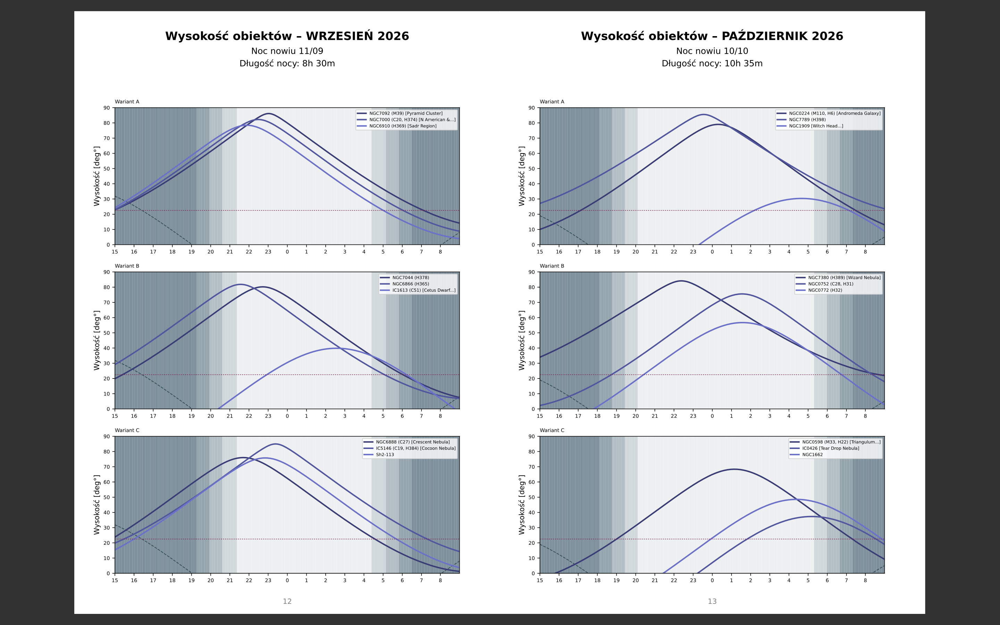
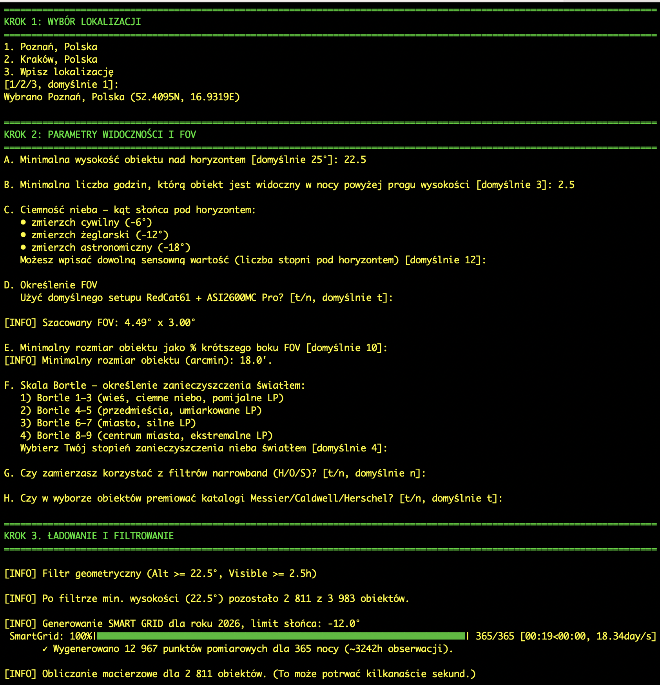
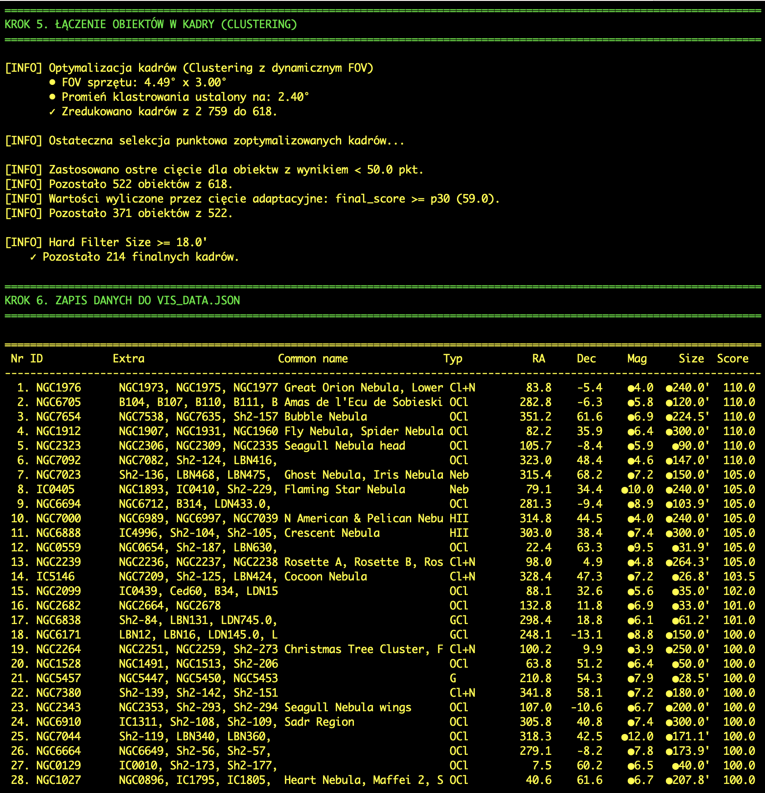
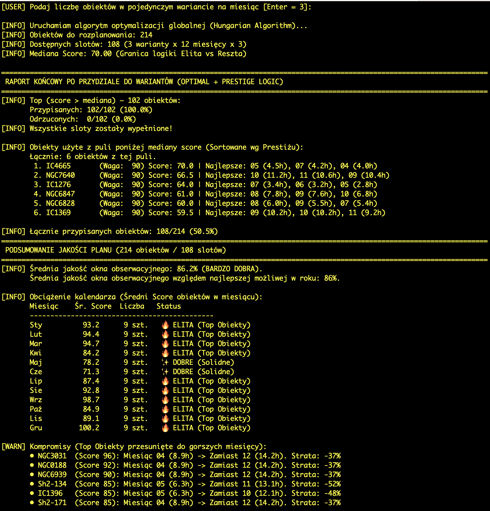

# 🔭 Astrophotography Planner & Atlas Generator

Kompleksowy zestaw narzędzi w Pythonie służący do generowania spersonalizowanego, [rocznego planera i atlasu](doc/AP_compressed.pdf). System automatycznie pobiera dane o obiektach, filtruje je pod kątem Twojego sprzętu i lokalizacji, oblicza widoczność na przestrzeni roku, rozplanowuje obserwacje, a następnie generuje profesjonalny dokument PDF gotowy do druku.


## 🚀 Możliwości

*   **Agregacja danych:** Pobieranie i łączenie katalogów (NGC/IC, Sharpless, Barnard, RCW, PGC, LBN, LDN, Cederblad) z bazy VizieR i OpenNGC.
*   **Smart Merge:** Inteligentne łączenie dublujących się obiektów (np. Mgławica Kalifornia jako NGC 1499 i Sh2-220) oraz klastrowanie obiektów mieszczących się w jednym kadrze (FOV).
*   **Punktacja (Scoring):** Ocenianie obiektów na podstawie ich rodzaju, jasności, rozmiaru oraz "sławy" (Messier, Caldwell, Herschel 400), a także kompletnosci danych.
*   **Obliczenia astronomiczne:** Precyzyjne wyliczanie ([AstroPy](https://www.astropy.org)) wysokości nad horyzontem i godzin obserwacyjnych (okno obserwacyjne) dla każdej nocy w roku z uwzględnieniem księżyca oraz zmierzchu (cywilnego, nautycznego i astronomicznego).
*   **Planowanie roczne:** Wykorzystanie algorytmu optymalizacji (Hungarian Algorithm) do przydzielenia najlepszych obiektów do optymalnych miesięcy obserwacyjnych. Raport na temat powodzenia i niepowodzeń w rozmiwszczaniu obiektów.



*   **Generowanie map:** Tworzenie symulacji pola widzenia (FOV) oraz map kontekstowych przy użyciu biblioteki `starplot`.
*   **Output:** Finalny plik PDF zawierający harmonogram roczny, szczegółowe karty obiektów oraz mapy.

## 🛠️ Wymagania i Instalacja

Projekt wymaga Pythona 3.10+ oraz szeregu bibliotek astronomicznych i graficznych.

1.  **Sklonuj repozytorium:**
    ```bash
    git clone https://github.com/tomaszgrabowskiop/astrophoto_planner.git
    cd astrophoto_planner
    ```

2.  **Zainstaluj zależności:**
    Zaleca się użycie wirtualnego środowiska (venv).
    ```bash
    pip install -r requirements.txt
    ```
    *Główne biblioteki to: `astropy`, `astroplan`, `starplot`, `pandas`, `matplotlib`, `reportlab`, `networkx`.*
    
    **UWAGA: pandas musi być poniżej wersji 3.0!** W przeciwnym razie `starplots` nie generuje map z kolorystycznym różnicowaniem gwiazd.

3.  **Przygotowanie danych:**
    Upewnij się, że w folderze `data/` znajduje się plik `NGC.csv` (baza [OpenNGC](https://github.com/mattiaverga/OpenNGC/tree/master)).

##Jak używać?

Proces składa się z 7 kroków, które należy uruchamiać sekwencyjnie. Każdy skrypt korzysta z danych wygenerowanych przez poprzedni.

### Krok 1: Budowa katalogu
```bash
python 1_build_catalog.py
```
*   Pobiera dane z pliku i z VizieR i łączy je w jeden spójny plik CSV (`katalog_astro_full.csv`).
*   Dokonuje normalizacji nazw, współrzędnych i "Entity Resolution" (łączenie tych samych obiektów z różnych katalogów).
*   *Interakcja:* Pyta o progi filtrowania (jasność mag, rozmiar kątowy), żeby odsiać drobnicę, która może nie interesować użytkownika.

### Krok 2: Konfiguracja i Scoring
```bash
python 2_plan_and_score.py
```
*   **Kluczowy etap konfiguracji użytkownika.**
*   Pyta o: rok, lokalizację (wyszukuje lokalizacji), parametry kamery/teleskopu (do obliczenia FOV), ewentualność używania filtrów _narrowband_, minimalną wysokość obiektu nad horyzontem, określenie wysokości Słońca pod horyzontem, zanieczyszczenie nieba światłem(Bortle). Wszystkie te parametry wpływają na dalesze wyliczenia. W szczególności dobór obiektów (lepsze punktowanie) zależy od tego czy są obiektami widocznymi przy użyciu filtrów i/lub czy ma wpływ Bortle < 5 (przyjąłem taką granicę dla np. ciemnych mgławic).



*   Szybkie przeliczenia dla oceny kryteriów. 
*   Przypisuje punktacje obiektom według kryteriów. 
*   Prezentuje tabelę z wynikami. 



*   Zapisuje wynik w `vis_data.json`.
### Krok 3: Obliczenia astronomiczne (Compute Engine)
```bash
python 3_compute.py
```
*   Najbardziej czasochłonny etap. Wykorzystuje silnik [AstroPy](https://www.astropy.org) i mimo włączenia obliczeń na wszystkich dostępnych rdzeniach (multiprocessing), potrzebuj czasu na przeprowadzenie kalkulacji.
*   Liczy widoczność obiektów dla każdej nocy w roku według zadanej siatki (domyślnie co minutę). Nakłada wynik na "pole nocy" określone zgodnie z limitem podanym przez użytkownika w drugim kroku. Oblicza jakościowe godziny obserwacyjne w skali roku (bez księżyca)
*   Cache'uje wyniki w `observing_data.pkl`, aby przy kolejnych uruchomieniach liczyć tylko zmiany. Jeżeli zmianie uległ rok lub lokalizacja wszystko jest przeliczane od zera. Jeżeli zmiana dotyczy limitów (obiekt nad horyzontem, zmierzch) przelicza się tylko maskę nakładaną na surowe dane. Jeżeli lista obiektów się zmieniła - obliczana jest przyrostowo. 

### Krok 4: Selekcja i Plan roczny
```bash
python 4_select_objects.py
```
*   Dzieli obiekty na dwie grupy według mediany. 
*   Najpierw rozmieszcza te powyżej mediany i dopiero jeśli wystarczy slotów, dokłada z obiektów poniżej mediany. 
*   Dla każdego miesiąca są dostępne trzy warianty (A, B, C). Użytkownik może określić liczbę obiektów w wariancie. 
*   Algorytm przypisuje obiekty do miesięcy zaczynając od najwyżej punktowanych obiektów, które są najrzadziej widoczne w ciągu roku. Jeżeli obiekt nie spełnia zadanych kryteriów - odpada. Jeśli spełnia trafia w najlepszy (pod względem okna obserwacyjnego) miesiąc, jeśli ten nie ma wolnych slotów, do kolejnego najlepszego i tak do skutku.



*   Generuje pierwszą część PDF: wykresy zbiorcze na każdy miesiąc. Prezentuje raport po przypisaniu obiektów do miesięcy i wariantów. Oblicza ogólne powodzenie i wskazuje obiekty, które nie trafiły do swojego najlepszego slotu, informuje, do którego slotu trafiły. 
*   Modyfikuje `vis_data.json` dodając flagę `selected`.

### Krok 5: Generowanie map nieba
```bash
python 5_generate_fov_and_ctx.py
```
*   Generuje pliki PNG dla każdego wybranego obiektu:
	*   **FOV:** Symulacja kadru Twojej kamery.
	*   **Context:** Mapa szerszego pola (szukacz/star hopping).
*   Pliki lądują w folderze `data/starplots/`.

### Krok 6: Tworzenie stron obiektów
```bash
python 6_generate_objects_pages.py
```
*   Generuje szczegółowe strony PDF dla każdego obiektu: 
	*   nazwa (indeks z katalogów Messier, Caldwell, Herschel - jeśli istnieją), typ, nazwa zwyczajowa, jelśi istnieje, indeksy innych obiektów w kadrze (ograniczone do 24, posegregowane według popularności katalogów),
	*   wykres wysokości w najlepszej nocy w miesiącu do którego obiekt został przypisany, informację o najlepszej nocy w roku i jej długości,
	*   kadr FOV policzony i wygenerowany zgodnie z parametrami użytkownika,
	*   wykres widocznosci w ciągu roku, na tle nocy według zadanego progu zmierzchu,
	*   wykres godzin jakościowych (bez księżyca) w skali roku,
	*   mapę kontekstową w różnej projekcji w zależności od wysokości obiektu (Dec).

### Krok 7: Finalizacja (Scalanie PDF)
```bash
python 7_generate_result_pdf.py
```
*   Dodaje stronę tytułową i informacyjną.
*   Łączy wszystkie wygenerowane wcześniej PDF-y w jeden kompletny plik: `Astrophotography_Planner_ROK_MIASTO.pdf`.


---

## 📂 Struktura plików

*   `shared.py` – Plik konfiguracyjny współdzielony przez wszystkie skrypty. Zawiera ścieżki (`PATHS`), klasy konfiguracyjne (`UserConfig`, `CameraConfig`) oraz stałe astronomiczne.
*   `analyse_catalog.py` – Narzędzie pomocnicze do statystycznej analizy pliku `katalog_astro_full.csv` (sprawdza kompletność danych, rozkład jasności itp.).
*   `data/` – Katalog roboczy, w którym przechowywane są pliki tymczasowe, cache obliczeń, grafiki i wyniki. W tym katalogu będą pojawiać się pliki z wynikami obliczeń, grafiki itp.
*   w ciągu pracy programów będą powstawać dodatkowe pliki w katalogu uruchomienia. W szczególności `starplots` pobiera swoje biblioteki. 

## ⚙️ Konfiguracja zaawansowana

Większość parametrów podaje się interaktywnie w krokach 1 i 2. Jednak stałe systemowe można edytować w pliku `shared.py` oraz na początku poszczególnych skryptów.

*   **CATALOG_PRIORITY:** W `shared.py` określa, który katalog jest "ważniejszy" przy łączeniu nazw (np. NGC > IC > Sh2). Jeżeli interesuje nas fotografia bardziej wymagająca (ciemne mgławice) można zmienić kolejność katalogów, żeby LDN był wyżej w hierarchii. W takim wypadku nie ma też potrzeby premiować za sławę (Messier, Caldwell, Herschel). 
*   **SCORING:** W `2_plan_and_score.py` znajdują się tabele punktacji (np. bonusy za obiekty Messiera, punkty za typ obiektu vs filtry wąskopasmowe). Można edytować, jeśli zależy nam, żeby konkretny typ obiektów przeszedł wyżej i nie został odrzucony. 

## 📄 Licencja

Projekt przeznaczony do użytku prywatnego i edukacyjnego. Nie jestem programistą ani astronomem. Zgłaszaj poprawki lub błędy, jeśli je zauważysz. 

Generowane mapy korzystają z danych z VizieR. [OpenNGC](https://github.com/mattiaverga/OpenNGC/tree/master) to osobny projekt częściowo wykorzystywany w tym repozytorium.
